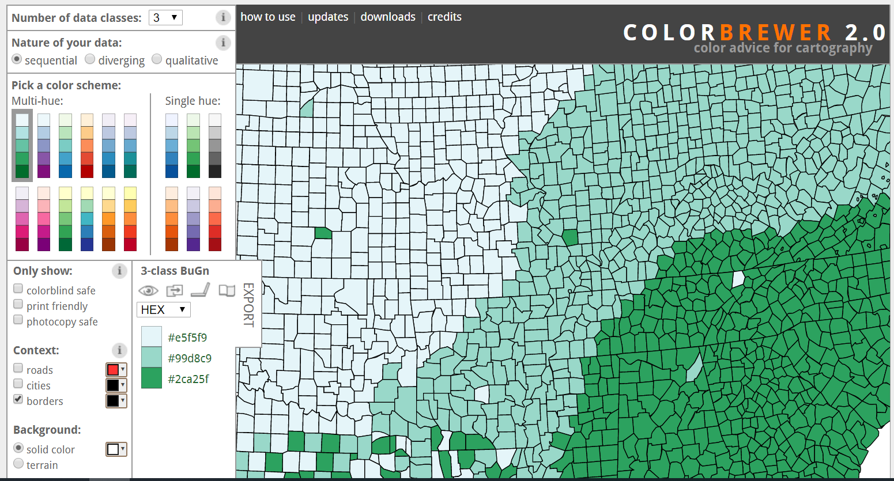

layout: false
class: inverse center middle text-white

.font200[Intro to RStudio Cloud]

```{r setup, include=FALSE}
#remotes::install_github("mitchelloharawild/icons")
library(fontawesome)
library(icons)
library(gapminder)
library(DT)
library(kableExtra)

knitr::opts_chunk$set(fig.width=5, fig.height=6, fig.retina=3,
                      out.width = "100%",
                      message=FALSE, warning=FALSE, cache = TRUE, 
                      autodep = TRUE, hiline=TRUE)

knitr::opts_hooks$set(fig.callout = function(options) {
  if (options$fig.callout) {
    options$echo <- FALSE
    options$out.height <- "99%"
    options$fig.width <- 14
    options$fig.height <- 16
  }
  options
})

options(htmltools.dir.version = FALSE, htmltools.preserve.raw = FALSE)

options(
  htmltools.dir.version = FALSE, 
  width = 90,
  max.print = 9999,
  knitr.table.format = "html"
)

as_table <- function(...) knitr::kable(..., format='html', digits = 3)
```

---
# About me

.pull-left[

.center[


.font150[**Dr. Laurie Baker**]

College of the Atlantic, Bar Harbor, ME
]]
.pull-right[

### Education

`r icons::fontawesome("graduation-cap")` BSc and MSc, Marine Biology
`r icons::fontawesome("graduation-cap")` PhD, Epidemiology
`r icons::fontawesome("certificate")` Certified Tidyverse Instructor, RStudio

### Research Interests

`r icons::fontawesome("syringe")`  Public Health, `r icons::fontawesome("fish")`  Ecology, `r icons::fontawesome("desktop")` Data Science
]

.center[
[`r icons::fontawesome("link")` lauriebaker.rbind.io](https://lauriebaker.rbind.io)
[`r icons::fontawesome("twitter")` @llbaker1707](https://twitter.com/llbaker1707)
[`r icons::icon_style(icons::fontawesome("github"), scale = 1)` @laurielbaker](https://github.com/laurielbaker)
]

---
layout: true
# What we'll cover today.
---

- Intro to spatial data and the `sf` package

--

- Building a map using `ggplot2`

--

- Coordinate Systems and geospatial objects in R

--

- Building interactive maps using `leaflet`. 

---
layout: true
# Packages for today's adventure
---

```{r}
library(tidyverse) ## For plotting and data wrangling.

library(leaflet) ## For leaflet interactive maps

library(sf) ## For spatial data

library(RColorBrewer) ## For colour palettes

library(htmltools) ## For html

library(leafsync) ## For placing plots side by side

library(kableExtra) ## Table  output (in slides)

```


---

layout: false
class: inverse center middle text-white

.font200[Introduction to the sf package]

---
layout: false

# Intro to Spatial Data

* Everything happens somewhere!

--
* We represent spatial data in a variety of ways: points, lines, polygons, rasters. 

```{r spatial-data-types, out.width = 900, fig.alt = "Diagram showing series of points (GPS locations), lines (roads), and polygons (e.g. countries and regions)", echo=FALSE}

knitr::include_graphics(path = "images/spatial_data_types.jpg")

```  

--
`r icons::icon_style(icons::fontawesome("lightbulb", style = "solid"), scale = 2)` What are some other examples of point, line, and polygon data?

---
layout: false

# The sf package

* Package for geospatial data manipulation and analysis that works with features
  * **points** (POINT, MULTIPOINT)
  * **lines** (LINESTRING, MULTILINESTRING)
  * **polygons** (POLYGON, MULTIPOLYGON)
  
```{r spatial-data-types2, out.width = 900, fig.alt = "Diagram showing series of points (GPS locations), lines (roads), and polygons (e.g. countries and regions)", echo=FALSE}

knitr::include_graphics(path = "images/spatial_data_types.jpg")

```  

`r icons::icon_style(icons::fontawesome("lightbulb", style = "solid"), scale = 2)` How do we represent these forms as data?

`r icons::icon_style(icons::fontawesome("info-circle", style = "solid"), scale = 1)` Hint: What do two points become when they are connected?
---
layout: true
# Births in North Carolina
---

* Let's load in the data for North Carolina (`nc`) from the package `sf` using the function `st_read`.

--

```{r nc-data, eval = TRUE, messages = FALSE}

nc_df <- st_read(system.file("shape/nc.shp", package="sf"))

```

* `st` = spatial type and `.shp` is a common geographic shape file format.

--

`r icons::icon_style(icons::fontawesome("info-circle", style = "solid"), scale = 1)`  `.shp` files come with a lot of other file types: `.shx`, `.dbf` etc. They all need to be kept together.

---
layout: true
# Rename the columns
---

* Number of births for counties in North Carolina in 1974 


*  Rename our columns to country, births, and geometry.

```{r nc-data2, eval = TRUE, messages = FALSE}

nc <- nc_df %>%
        select("NAME", "BIR74", "BIR79", "geometry") %>%
        rename("county" = "NAME", "births1974" = "BIR74", "births1979" = "BIR79")

```
<br>
<br>
<br>
<br>

`r icons::icon_style(icons::fontawesome("info-circle", style = "solid"), scale = 1)` The pipe symbol `%>%` means "and then". It's a way to combine multiple functions into an assembly line.

---
layout: true
# Getting to know the data
---

* Let's load in the data for North Carolina (nc)

```{r nc-view, eval = TRUE}

head(nc)

```

`r icons::icon_style(icons::fontawesome("info-circle", style = "solid"), scale = 1)` `head()` is a useful function that returns the first 6 rows of the data
---
layout: true
# And inspect the structure
---

```{r nc-str, eval = TRUE}

str(nc)

```

`r icons::icon_style(icons::fontawesome("info-circle", style = "solid"), scale = 1)` `str()` shows the structure of the data including the data types: `num`: numeric, `chr`: character, `sfc`: simple feature list column. 
---
layout: false
class: inverse center middle text-white

.font200[Plotting a map with ggplot2]


---
layout: true
# Building a map in ggplot2
---

.left-code[

```{r first-map1a, eval=FALSE}
ggplot(nc) #<<

```

* .hlb[Data]
* Geom
* Aesthetics
* Labels
* Scales

`r icons::icon_style(icons::fontawesome("info-circle", style = "solid"), scale = 1)` Every plot starts with data.
]

.right-plot[
```{r first-map1a, ref.label='first-map1a', echo=FALSE, out.width="95%", fig.alt="Empty plotting area"}
```
]

---

.left-code[

```{r first-map1b, eval=FALSE}
ggplot(nc) +
  geom_sf() #<<
```

* Data
* .hlb[Geom]
* Aesthetics
* Labels
* Scales

`r icons::icon_style(icons::fontawesome("info-circle", style = "solid"), scale = 1)` `geom_sf()` is reading our `geometry` column which contains the coordinates and creating our map from there.
]

.right-plot[
```{r first-map1b, ref.label='first-map1b', echo=FALSE, out.width="95%", fig.alt="Map of North Carolina showing border of counties."}
```
]

---

.left-code[


```{r first-map1c, eval=FALSE}
ggplot(nc) +
  geom_sf(aes(fill = births1974)) #<<
```

* Data
* Geom
* .hlb[Aesthetics]
* Labels
* Scales

`r icons::icon_style(icons::fontawesome("info-circle", style = "solid"), scale = 1)` `aes()` relates our variables (columns) to visual elements on the plot.

]

.right-plot[
```{r first-map1c, ref.label='first-map1c', echo=FALSE, out.width="95%", fig.alt="Map of North Carolina with administrative regions filled by number of births in North Carolina counties from 1974-78."}
```
]

---

.left-code[

```{r first-map1d, eval=FALSE}
ggplot(nc) +
  geom_sf(aes(fill = births1974)) +
  labs(title = "Births per county in 1974-1978", #<<
       x = "Longitude", #<<
       y = "Latitude", #<<
       fill = "# Births") #<<
```

* Data
* Geom
* Aesthetics
* .hlb[Labels]
* Scales

`r icons::icon_style(icons::fontawesome("info-circle", style = "solid"), scale = 1)` `labs()` adds labels to our plot.
]

.right-plot[
```{r first-map1d, ref.label='first-map1d', echo=FALSE, out.width="95%", fig.alt="Map updated to include a title, x and y axis labels, and a legend.  Map of North Carolina with administrative regions filled by number of births in North Carolina counties from 1974-78. On the x axis, longitude, on the y axis latitude, and a legend indicating the number of suddent infant death cases."}
```
]

---

.left-code[

```{r first-map1e, eval=FALSE}
ggplot(nc) +
  geom_sf(aes(fill = births1974)) +
  labs(title = "Births per county in 1974-1978",
       x = "Longitude",
       y = "Latitude", 
       fill = "# births") +
  scale_y_continuous(breaks = 34:36) #<<
```

* Data
* Geom
* Aesthetics
* Labels
* .hlb[Scales]

`r icons::icon_style(icons::fontawesome("info-circle", style = "solid"), scale = 1)` `scales` to change range.
]

.right-plot[
```{r first-map1e, ref.label='first-map1e', echo=FALSE, out.width="95%", fig.alt="Map updated so that the y axis has breaks at 34, 35, and 36 degrees latitude. Map of North Carolina with administrative regions filled by number of births in North Carolina counties from 1974-78. On the x axis, longitude, on the y axis latitude, and a legend indicating the number of suddent infant death cases."}
```
]

---
layout: true
# Coordinate reference system
---

* Every location on earth is specified by a longitude and latitude. 

--

* The challenge is transferring a 3D object to a 2D surface.

--

```{r orange-peel-projection, out.width = 800, fig.alt = "Orange peel with earth drawn on it flattened in shape of Goode projection", echo=FALSE}

knitr::include_graphics(path = "images/OrangePeelProGoode.jpg")

```

--

* The Coordinate Reference system (CRS) determines how the data will be projected onto a map. 

---
layout: true
# Coordinate reference system
---

* We can flatten a 3D object to 2D in multiple ways

<figure>
  
</figure>
[Projection Transitions](https://bl.ocks.org/mbostock/raw/3711652/) by Mick Bostock 
---
layout: true
# Coordinate reference systems skew true size
---

```{r kenya-true-size, fig.alt = "Map of the world showing France overlaid on Greenland. The map demonstrates how coordinate reference systems skew our perception of how big a country is", echo=FALSE, out.width = "50%"}

knitr::include_graphics(path = "France_true_size.PNG")

```

[The True Size Of: thetruesize.com](https://thetruesize.com/#?borders=1~!MTczMDY3NDE.MTE4OTczMjc*MjU3NDY1NzA(MzkyMTU3MA~!KE*OTYxNTIxNw.MTY3MDYyNzg)


---
layout: true
# Checking the coordinate reference system
---


* We can check the CRS using `st_crs`:

```{r checking the CRS}

st_crs(nc)

```

---
layout: true
# Transforming coordinate reference system
---

* You can transform a coordinate reference system using `st_transform()`. 

--

* But what is a sensible coordinate reference system to assign? 

--

* EPSG 4326 aka WGS 1984 is a standard for use in cartography used by GPS technologies and is the default in leaflet.

```{r changing the CRS using st_transform}

nc <- st_transform(nc, "+init=epsg:4326")

st_crs(nc)

```

---
layout: true
# Recap
---

* Spatial data are represented as points, lines, polygons, and rasters.

--

* We can store these spatial features as `geometry` using the `sf` package.

--

* When we are working with spatial data we need to take into account the coordinate reference system.

--

* We can use other information in our data set to create the visual elements of our map. 

---
layout: false
class: inverse center middle text-white

.font200[Introduction to leaflet mapping]

---
layout: true
# Introduction to leaflet mapping
---

* Leaflet is one of the most popular open-source JavaScript libraries for interactive maps

* Like `ggplot2` it is built in layers on top of a base map


---
layout: true
# Our first leaflet map
---

.left-code[

* Every plot starts with `leaflet()`

```{r first-leaflet-map1a, eval=FALSE}

leaflet(data = nc) 

```
]

.right-plot[
```{r first-leaflet-map1a, ref.label='first-leaflet-map1a', echo=FALSE, out.width="100%", fig.alt = "Gray square showing blank base where leaflet map will be plotted"}
```
]

---

.left-code[

* Layers are added using `%>%`

```{r first-leaflet-map1b, eval=FALSE}
leaflet(data = nc) %>%
  addTiles() #<<
```
]

.right-plot[
```{r first-leaflet-map1b, ref.label='first-leaflet-map1b', echo=FALSE, out.width="100%", fig.alt = "Leaflet map showing map of the world zoomed out so that the world is repeating"}
```
]

--


N.B. Layers are added with `%>%` in `leaflet` and `+` in `ggplot`. `%>%` also is used in the `tidyverse` packages. 


---

.left-code[

* We can set the view using `setView()`

```{r first-leaflet-map1c, eval=FALSE}
leaflet(data = nc) %>%
  addTiles() %>%
  setView(lng = -80, #<<
          lat = 34.5, #<<
          zoom = 5) #<<
```

* **Your Turn**: Try setting lng to 3.17 and lat to 44.37. Try setting different values between 0 and 10 for the zoom.


<!-- * **Your Turn**: Try setting lng to 38 and lat to 1. Try setting different values between 0 and 10 for the zoom. -->

]

.right-plot[
```{r first-leaflet-map1c, ref.label='first-leaflet-map1c', echo=FALSE, out.width="100%", fig.alt = "OpenStreet base map showing the south-eastern USA including states east of Missouri and Louisianna."}
```
]

---

.left-code[

* We can set the view using `setView()`

```{r first-leaflet-map-france, eval=FALSE}
leaflet(data = nc) %>%
  addTiles() %>%
  setView(lng = 3.17, #<<
          lat = 44.37, #<<
          zoom = 6) #<<
```

```{r first-leaflet-map-kenya, eval=FALSE, echo = FALSE}
leaflet(data = nc) %>%
  addTiles() %>%
  setView(lng = 38, #<<
          lat = 1, #<<
          zoom = 6) #<<
```


]

.right-plot[
```{r first-leaflet-map-kenya, ref.label='first-leaflet-map-kenya', echo=FALSE, eval=FALSE, out.width="100%", fig.alt="Leaflet map of Kenya with open street map background"}
```

```{r first-leaflet-map-france, ref.label='first-leaflet-map-france', echo=FALSE, out.width="100%", fig.alt="Leaflet map of France with open street map background"}
```
]

---
layout: true
# Our first leaflet map
---

.left-code[
* `addProviderTiles` give different base maps

```{r first-leaflet-map1d-provider, eval=FALSE}
leaflet(data = nc) %>%
  addProviderTiles(providers$Stamen.Terrain) %>%
  setView(lng = -80, 
          lat = 34.5, 
          zoom = 5)
```

* **Your Turn**: Choose a different provider tile: `providers$` + `Tab`. 
]

.right-plot[

```{r first-leaflet-map1d-provider, ref.label='first-leaflet-map1d-provider', echo=FALSE, out.width="100%", fig.alt = "Leaflet map of Southeastern USA with terrain base map"}
```

N.B. The different provider tiles come with different licensing and some require an API.
]

---

.left-code[
* Add polygons using `addPolygons()`

```{r first-leaflet-map1e, eval=FALSE}
leaflet(data = nc) %>%
  addProviderTiles(providers$Stamen.Terrain) %>%
  setView(lng = -80, 
          lat = 34.5, 
          zoom = 5) %>%
  addPolygons() #<<
```
]

.right-plot[
```{r first-leaflet-map1e, ref.label='first-leaflet-map1e', echo=FALSE, fig.alt="Leaflet map of Southeastern USA with terrain base map with blue polygons showing outline of counties in North Carolina"}
```
]

---
layout: true

# Creating a colour palette
---


```{r Color-brewer, echo = FALSE, out.width=550, fig.align='center', fig.alt="Map of U.S. Counties showing green blue colour scheme"}


```


* What type of variables are we showing (numerical, categorical)? 

--

* Who is our audience?

--

* What story are we telling with our data? 

--

* Choose your colours: [ColorBrewer2.org](https://colorbrewer2.org/#type=sequential&scheme=BuGn&n=3) and https://www.colorcodepicker.com/ 

---
layout: true

# Creating a colour palette
---

* Is our data numeric?


```{r numeric-data, out.width = 800, fig.alt = "Yellow chick describing how tall it is (3.1 inches) and how much it weighs (34.16 grams) to illustrate continuous data, measured data that can have infinite values within a possible range. An octopus describing how many legs it has (8) and how many spots it has (4) to illustrate discrete observations that can only exist at limited values, often counts.", echo=FALSE}

knitr::include_graphics(path = "images/continuous_discrete.png")

```  

---
layout: true
# Creating a colour palette
---

* Is our data categorical?

```{r categorical-data, out.width = 800, fig.alt = "Species such as turtle, snail, and butterfly are unordered descriptions known as nominal data. Emotiosn are an example of ordinal data (e.g. I am an awesome bee, I am an unhappy bee, I am an okay bee). Extinct (dinosaur) and not extinct (shark) are examples of binary data where there are only two possibilities", echo=FALSE}

knitr::include_graphics(path = "images/nominal_ordinal_binary.png")

```


---
layout: true

# Creating a colour palette
---

* `RColorBrewer` includes **sequential** colour palettes (e.g. number of people).

```{r pal-sequential, eval=TRUE, out.width="45%", fig.alt="Diagram showing sequential palettes available in RColorBrewer including Orange to Red and more"}
display.brewer.all(type = "seq", colorblindFriendly = TRUE)
```

---
layout: true
# Creating a colour palette
---

* `RColorBrewer` includes **diverging** colour palettes (e.g. to show above or below).


```{r pal-diverging, eval=TRUE, out.width="45%", fig.alt="Diagram showing sequential palettes available in RColorBrewer including Spectral and Red to Blue"}
display.brewer.all(type = "div", colorblindFriendly = TRUE)
```


---
layout: true

# Creating a colour palette
---

* First we will define the colour palette and bins for the plot.

```{r Defining colour bins, eval = TRUE}

summary(nc$births1974)

bins <- seq(from = 0, to = 25000, by = 5000) 
```

--

* Then we can define the colours for the palette:


```{r Defining the palette, eval = TRUE}
pal74 <- colorBin("OrRd", domain = nc$births1974, bins = bins) 
```


---

.left-code[

* Customizing `addPolygons()`

```{r first-leaflet-map1f, eval=FALSE}
leaflet(data = nc) %>%
  addProviderTiles(providers$Esri.OceanBasemap) %>%
  setView(lng = -80, 
          lat = 34.5, 
          zoom = 6) %>%
  addPolygons(
    fillColor = ~pal74(nc$births1974),
    fillOpacity = 0.7, #<<
    color = "white", #<<
    opacity = 1, #<<
    weight = 2 #<<
  ) 
```
]

.right-plot[
```{r first-leaflet-map1f, ref.label='first-leaflet-map1f', echo=FALSE, out.width="100%", fig.alt="Leaflet map of Southeastern USA with ESRI ocean base map with white polygons showing outline of counties in North Carolina. Counties are colored by the number of births. The fill is set to be partly transparent."}
```
]

---

.left-code[

* Customising `addPolygons()`

```{r first-leaflet-map1g, eval=FALSE}
leaflet(data = nc) %>%
  addProviderTiles(providers$Esri.OceanBasemap) %>%
  setView(lng = -80, 
          lat = 34.5, 
          zoom = 6) %>%
  addPolygons(
    fillColor = ~pal74(nc$births1974), #<<
    fillOpacity = 1, #<<
    color = "blue", #<<
    opacity = 0.7, #<<
    weight = 1 #<<
  ) 
```

]

.right-plot[
```{r first-leaflet-map1g, ref.label='first-leaflet-map1g', echo=FALSE, out.width="100%", fig.alt="Leaflet map of Southeastern USA with ESRI ocean base map with blue polygons showing outline of counties in North Carolina. Counties are colored by the number of births. The fill is not transparent."}
```

* **Your Turn** Try changing the `color`, `opacity`, and `weight`
]

---
layout: true
# What can you customise in addPolygons()
---

```{r what can you customise with addPolygons, eval = FALSE}

?addPolygons()

```

* `color:` stroke color
* `weight:` stroke width in pixels
* `opacity:` stroke opacity
* `fillColor:` fill color
* `fillOpacity:` fill opacity

--

* `highlightOptions:` Options for highlighting the shape on mouse over. 


---

.left-code[

* Let's assign our plot to an object.

```{r first-leaflet-map1h, eval=FALSE}
m1 <- leaflet(data = nc) %>% #<<
  addProviderTiles(providers$Stamen.Terrain) %>%
  setView(lng = -80, 
          lat = 34.5, 
          zoom = 6)

m1 %>%
  addPolygons(
    fillColor = ~pal74(nc$births1974), 
    fillOpacity = 0.7,
    opacity = 1,
    color = "white", 
    weight = 2) 


```
]

.right-plot[
```{r first-leaflet-map1h, ref.label='first-leaflet-map1h', echo=FALSE, out.width="100%", fig.alt="Leaflet map of Southeastern USA with the terrain base map with blue polygons showing outline of counties in North Carolina. Counties are colored by the number of births. The fill is set to be partly transparent, the color of the administrative unit border is white."}
```
]

---

.left-code[

* Let's add some `highlightOptions`

```{r first-leaflet-map1j, eval=FALSE}
m1 %>%
  addPolygons(
      fillColor = ~pal74(nc$births1974), 
      fillOpacity = 0.7, 
      color = "white", 
      opacity = 1,
      weight = 2,
    highlight = highlightOptions( #<<
        weight = 3, #<<
        color = "blue", #<<
        fillOpacity = 1, #<<
        bringToFront = TRUE)) #<< 
```
]

.right-plot[
```{r first-leaflet-map1j, ref.label='first-leaflet-map1j', echo=FALSE, out.width="100%", fig.alt="Leaflet map of Southeastern USA with ESRI ocean base map with white polygons showing outline of counties in North Carolina. Counties are colored by the number of births. When you hover over a county the border turns blue and becomes thicker, and the fill is not transparent and the county is brought forward."}
```
]

---
layout: true
# Let's add some labels!
---

`sprintf`: returns a character vector containing a formatted combination of text and variable values.


```{r Make our labels}
labels <- sprintf("<strong>%s</strong><br/>%g births", 
                  nc$county, nc$births1974) %>% lapply(htmltools::HTML)

head(labels, 1)
```

--

html - markup language for the web
* `<strong>` = bold; `<br/>` = new line

--

PHP - Hypertext Preprocessor
* `%s` = place holder for a character string; `%g` = general format place holder for a number

---

.left-code[

* Let's add some labels

```{r first-leaflet-map1k, eval=FALSE}
(m1 <- m1 %>%
  addPolygons(data = nc,
      fillColor = ~pal74(nc$births1974),
      fillOpacity = 0.7,
      color = "white",
      opacity = 1,
      weight = 2,
      highlight = highlightOptions(
        weight = 3,
        color = "blue",
        fillOpacity = 1,
        bringToFront = TRUE),
      label = labels)) #<< 

```
]

.right-plot[
```{r first-leaflet-map1k, ref.label='first-leaflet-map1k', echo=FALSE, out.width="100%", fig.alt="Leaflet map of Southeastern USA with ESRI ocean base map with white polygons showing outline of counties in North Carolina. Counties are colored by the number of births. When you hover over a county the border turns blue and becomes thicker, and the fill is not transparent and the county is brought forward. The map also includes labels reporting the number of births and the name of the county."}
```
]

---

.left-code[

* Let's add a legend

```{r first-leaflet-map1l, eval=FALSE}
m1 <- m1 %>%
  addLegend( #<<
    position = "bottomright", #<<
    pal = pal74, #<<
    values = ~nc$births1974, #<<
    title = "Births by county in 1974", #<<
    opacity = 1) #<<

m1
```
]

.right-plot[
```{r first-leaflet-map1l, ref.label='first-leaflet-map1l', echo=FALSE, out.width="100%", fig.alt="Leaflet map of Southeastern USA with ESRI ocean base map with white polygons showing outline of counties in North Carolina. Counties are colored by the number of cases of births. When you hover over a county the border turns blue and becomes thicker, and the fill is not transparent and the county is brought forward. The map also includes labels reporting the number of births and the name of the county. There is a legend in the bottom right which shows the Red Orange palette. Dark red = 30,000-35,000; Light orange = 0-5,000"}
```
]
---
layout: true
# Leaflet map with points
---

```{r leaflet-map-points, echo = FALSE}

work <- data.frame(
  "location" = c("Valparaíso, Chile", 
                 "Curitiba, Brasil", 
                 "Sable Island, Nova Scotia", 
                 "Greifswald, Germany",
                 "Arusha, Tanzania",
                 "Kigali, Rwanda",
                 "Kingston, Jamaica",
                 "Asunción, Paraguay",
                 "East Kilbride, Scotland"), 
  "institute" = c("Instituto de Fomento Pesquero", 
                  "Universidade Federal do Paraná", 
                  "Dalhousie University", 
                  "Friedrich Loeffler Institut",
                  "Nelson Mandela African Institute of Science and Technology",
                  "National Institute of Statistics Rwanda",
                  "Caribbean National Statistical Offices",
                  "El Ministerio de Salud Pública y Bienestar Social y el Ministerio de Educación y Ciencias - Paraguay",
                  "Foreign Commonwealth Development Office"), 
  "work" = c("Chilean Pink Cusk Eel", 
             "Fox rabies", 
             "Grey seals", 
             "Fox rabies",
             "Teaching",
             "Teaching",
             "Teaching",
             "Teaching",
             "Teaching"), 
  "lat" = c(-33.0472, 
            -25.4290, 
            43.9337, 
            54.0865,
            -3.3995,
            -1.9415,
            18.0179,
            -25.2637,
            55.760869), 
  "lon" = c(-71.6127, 
            -49.2671, 
            -59.9149, 
            13.3923,
            36.7968,
            30.0574,
            -76.8099,
            -57.5759,
            -4.22407), 
  "icon" = c("fish", 
             "disease", 
             "gps", 
             "disease",
             "training",
             "training",
             "training",
             "training", 
             "training"))
```

```{r data-preview} 

head(work)

```

---
layout: true
# Leaflet map with points
---

.left-code[
```{r leaflet-map-work, eval=FALSE}

leaflet(work) %>% 
      addProviderTiles(providers$Stamen.Watercolor) %>%
      addProviderTiles(providers$Stamen.TerrainLabels) %>%
      addCircleMarkers(~lon, ~lat)
```

* **Your Turn** What else can you change about addCircleMarkers? Hint: Type `??addControl` Try adding: `clusterOptions = markerClusterOptions()` to your map. 

]

.right-plot[

```{r leaflet-map-work, ref.label='leaflet-map-work', out.width="100%", echo=FALSE, fig.alt="Water colour leaflet map of the world with blue dots representing the locations of different work projects in North America, South America, Europe and Africa."}
```

]


---

.left-code[


```{r work-leaflet-map2, eval=FALSE}
leaflet(work) %>% 
      addProviderTiles(providers$Stamen.Watercolor) %>%
      addProviderTiles(providers$Stamen.TerrainLabels) %>%
      addCircleMarkers(~lon, ~lat, clusterOptions = markerClusterOptions())
```

* **Your Turn** What else can you change about addCircleMarkers? Hint: Type `??addControl` Try adding: `clusterOptions = markerClusterOptions()` to your map. 
]

.right-plot[

```{r work-leaflet-map2, ref.label='work-leaflet-map2', echo=FALSE, out.width="100%", fig.alt="Water colour leaflet map of the world with clusters with the numbers 1-3 representing the locations of different work projects in North America, South America, Europe and Africa."}
```

]


---

* Add labels

```{r point-labels}


labels <- sprintf(
  "<strong>%s</strong>",
  work$institute) %>% lapply(htmltools::HTML)

```

---

.left-code[

```{r work-map-labels, eval=FALSE}
leaflet(work) %>% 
    addProviderTiles(providers$Stamen.Watercolor) %>%
    addProviderTiles(providers$Stamen.TerrainLabels) %>%
    addCircleMarkers(~lon, ~lat, 
                     popup = ~labels)
```
]

.right-plot[

```{r work-map-labels, ref.label='work-map-labels', echo=FALSE, out.width="100%", fig.alt="Water colour leaflet map of the world with blue dots representing the locations of different work projects in North America, South America, Europe and Africa. Labels with the name of the institute and country appear when you click on the dot"}
```

] 

---
layout: true
# Recap


* Leaflet maps are built in layers using `%>%`

* Every leaflet map starts with a base map which we can customize by setting the view, adding provider tiles.

* We choose a geometric shape depending on our spatial data type (e.g. `addPolygons` or `addCircleMarkers`). 

* In choosing a color palette we need to think about our data types and our audience.

 * We can add interactivity to our plot using highlight and labels. 
---

---
layout: true
# Choose your own adventure
---

* **Option 1** Create a new map with the births from 1979.
* **Option 2** Change around the different visual elements of the plots. 
* **Option 3** Create a new set of labels for the leaflet map with points.
* **Option 4** Check out the short tutorial on joins. 
* **Option 5** Create a new variable that calculates how many births above or below the average counties are. Choose a palette that will be best to show this. 

---
layout: true
# Useful resources:
---

* [RStudio leaflet (Tutorial)](https://rstudio.github.io/leaflet/)
* [Geocomputation with R (Book)](https://geocompr.robinlovelace.net/preface.html)
* [Afrimapr: Intro to Spatial Data in R (Tutorial)](https://andysouth.shinyapps.io/intro-to-spatial-r/)
* [Afrimapr: Getting Data into R (Tutorial) ](https://andysouth.shinyapps.io/get-my-data-in/)
* [Afrimapr: Joining Spreadsheet Data (Tutorial) ](https://andysouth.shinyapps.io/get-my-data-in/)


---
class: inverse, center, middle
layout: true

# Thanks!


Slides created via the R package [xaringan](https://github.com/yihui/xaringan).

The chakra comes from [remark.js](https://remarkjs.com), [knitr](http://yihui.org/knitr), and [R Markdown](https://rmarkdown.rstudio.com).

.font150.text-white[
Special thanks to Rich Leyshon at the Data Science Campus and Kemunto Ongera at Bates College
]

.font150.text-white[
Slides template adapted from Garrick Aden-Buie GitHub: <http://github.com/gadenbuie/gentle-ggplot2>
]

---
class: inverse, center, middle
layout: true
# Additional Slides
---

---
layout: true
# Colorbins
---


```{r Defining colour bins2, eval = TRUE}

summary(nc$births1979)

bins <- seq(from = 0, to = 35000, by = 5000) 
```

---

* Then we can define the colours for the palette:


```{r Defining the palette2, eval = TRUE}

pal79 <- colorBin("OrRd", domain = nc$births1979, bins = bins)
```


---
layout: true
# Let's create a second map
---

* Let's create a second map of births in 1979.

* First we'll need to create a new set of labels

```{r labels for second map blank, eval=FALSE}

labels79 <- sprintf(
  "<strong>%s</strong><br/>%g births",
  nc$county, nc$births1974
) %>% lapply(htmltools::HTML)


```

* **Your Turn** Using `names(nc)` to check the column names, change `nc$births1974` to the column which corresponds to number of births in 1979.

```{r labels for second map, echo=FALSE}

labels79 <- sprintf(
  "<strong>%s</strong><br/>%g births",
  nc$county, nc$births1979
) %>% lapply(htmltools::HTML)


```

---
layout: true
# Let's create a second map
---

```{r}

m2 <- leaflet(data = nc) %>%
  addProviderTiles(providers$Stamen.Terrain) %>%
  setView(lng = -80, lat = 34.5, zoom = 6) %>%
  addPolygons(
      fillColor = ~pal79(nc$births1979),
      fillOpacity = 0.7,
      color = "white",
      opacity = 1,
      weight = 2,
      highlight = highlightOptions(
        weight = 3,
        color = "blue",
        fillOpacity = 1,
        bringToFront = TRUE),
      label = labels79)

```

---


```{r leaflet-map2a, eval=TRUE, fig.alt="Leaflet map of Southeastern USA with terrain base map with white polygons showing outline of counties in North Carolina. Counties are colored by the number of births from 1979-1984. When you hover over a county the border turns blue and becomes thicker, and the fill is not transparent and the county is brought forward. The map also includes labels reporting the number of births and the name of the county. There is a legend in the bottom right which shows the Red Orange palette. Dark red = 30,000-35,000; Light orange = 0-5,000"}
m2 <- m2 %>%
  addLegend(
    position = "bottomright",
    pal = pal79,
    values = ~nc$births1979,
    title = "Births by country in 1979",
    opacity = 1)

```

---

```{r, fig.alt="Leaflet map of Southeastern USA with terrain base map with white polygons showing outline of counties in North Carolina. Counties are colored by the number of births from 1979-1984. When you hover over a county the border turns blue and becomes thicker, and the fill is not transparent and the county is brought forward. The map also includes labels reporting the number of births and the name of the county. There is a legend in the bottom right which shows the Red Orange palette. Dark red = 30,000-35,000; Light orange = 0-5,000"}

m2
```


---
layout: true
# Placing two maps side by side
---

```{r leaflet-map3, fig.alt="Side by side Leaflet maps of Southeastern USA with terrain base map with white polygons showing outline of counties in North Carolina. Counties are colored by the number of births from 1974-1978 (left-side) and 1979-1984 (right-side). When you hover over a county the border turns blue and becomes thicker, and the fill is not transparent and the county is brought forward. The map also includes labels reporting the number of births and the name of the county. There is a legend in the bottom right which shows the Red Orange palette. Dark red = 30,000-35,000; Light orange = 0-5,000"}

leafsync::sync(m1, m2, ncol = 2, sync = "all")
```

